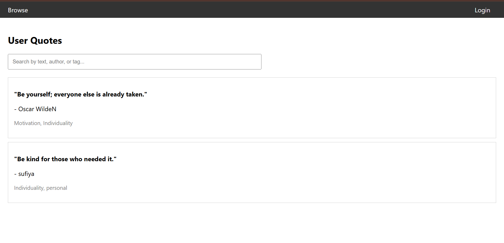
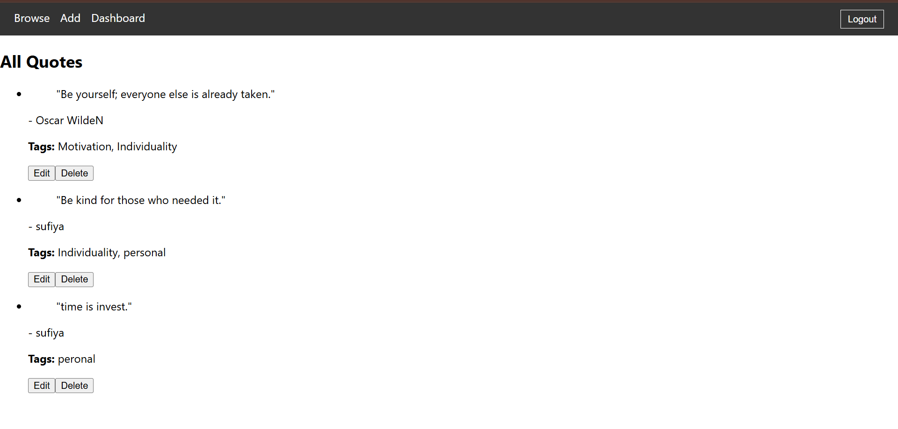

# 📜 Quote Manager App

A simple full-stack application to manage, add, and browse quotes. Built with:

- ✅ React (Frontend)
- ✅ Node.js + Express (Backend)
-  JSON File as Database (No MongoDB)

---

## 📸 Screenshots

### 🏠 Home Page (User Side)


### 🛠️ Admin Dashboard


---

## 📁 Folder Structure

```
quote-app/
├── client/   → React frontend
├── server/   → Node.js backend + JSON DB
```

---

## 🚀 How to Run Locally

### 1. Clone the repo
```bash
git clone https://github.com/Sufiya14/quote-app.git
cd quote-app
```

### 2. Setup Backend
```bash
cd server
npm install
node server.js
```

### 3. Setup Frontend
```bash
cd ../client
npm install
npm start
```

Frontend runs on: [http://localhost:3000](http://localhost:3000)  
Backend runs on: [http://localhost:5000](http://localhost:5000)

---

## 📦 Features

- Add, Edit, Delete Quotes (Admin)
- View and Search Quotes (User)
- Token-based Auth for Admin
- No MongoDB – Uses simple JSON as storage

---

## 🛠️ Tech Stack

| Technology | Use |
|------------|-----|
| React      | Frontend |
| Axios      | API Calls |
| Express.js | Backend |
| JSON File  | Acts as DB |

---

## ✍️ Author

Made with ❤️ by [Sufiya](https://github.com/Sufiya14)
